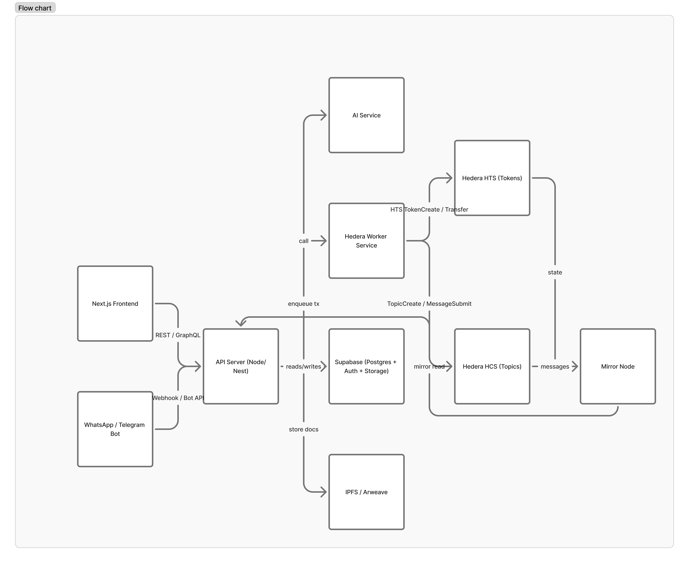

# Homebaise

> **Tagline:** “Own, invest, and build trust in Africa — one block at a time.”

**🏆 Hackathon Track:** Onchain Finance & Real-World Assets (RWA)

---

## 🚩 Problem
Millions of Nigerians & Africans struggle with land fraud, missing property records, and lack of access to safe investments.

- Diaspora remittances ($53B into Africa yearly) mostly go into consumption, not wealth-building assets.
- Farmers and property owners can’t unlock liquidity from their assets.

---

## 💡 Solution (Homebaise)
A Hedera-powered RWA platform that:
- Tokenizes land, property & farms into secure digital shares.
- Enables fractional ownership & investment — start with as little as $10.
- Connects diaspora remittances directly into real assets back home.
- Provides yield & liquidity through property rentals or crop revenue sharing.

---

## 🔑 Features
- 📜 **Onchain Land Registry:** Transparent, tamper-proof, fraud-proof
- 🌍 **Diaspora Gateway:** Send remittances as investments, not just cash
- 💸 **Micro-Investments:** Buy fractions of real estate or farmland
- 🌱 **Farmer Financing:** Tokenized crops & collateral-based loans
- 🔒 **Trust Layer:** Hedera's DLT ensures fairness, speed & low costs

---

## 🚀 Planned Features: Property Token Collateralization

### Using Homebaise Property Tokens as Collateral

Once properties are tokenized via the Hedera Token Service (HTS), each token represents a verified, on-chain share of real estate value. That means those tokens can serve as backed digital assets and be used as collateral for loans or credit within the ecosystem.

### 💡 Possible Implementations

**DeFi Collateralization Layer**
- Integrate with lending protocols (like Aave or HBAR-native protocols such as SaucerSwap or Heliswap extensions)
- Users can stake their property tokens (e.g., ZOVT) as collateral
- They receive stablecoins, HBAR, or Homebaise credits in return — all managed via smart contracts

**Peer-to-Peer Lending (P2P)**
- Token holders can offer their tokens as collateral for community-driven loans
- The loan agreement is recorded on Hedera Consensus Service (HCS) for transparency
- If repayment fails, the tokenized property shares are automatically transferred to the lender

**Real Estate Credit Scores (AI + Onchain)**
- Homebaise AI can assess risk and yield potential of collateralized assets
- Users with a strong investment track record and verified identity get better credit terms
- This creates a trustless property credit market

**Stablecoin-Backed Loans**
- Borrow against your property tokens in stable assets (e.g., USDC, HUSD, or future Homebaise-stable)
- Useful for developers or investors who want liquidity without selling their property shares

### 🌟 Why It's a Big Deal

- **Unlocks liquidity** from traditionally illiquid real estate assets
- **Bridges DeFi + Real Estate**, enabling real yield backed by real assets
- **Empowers African investors** to access credit using verifiable, tokenized property holdings — not just fiat collateral
- **Creates a sustainable DeFi loop** around property ownership, income, and lending

### 🔮 Impact on Web3 & Hedera

This feature positions Homebaise as a bridge between traditional real estate and decentralized finance, showcasing how **Real-World Assets (RWA)** can unlock new financial primitives on Hedera:

- **Demonstrates RWA utility beyond simple tokenization** — tokens become functional financial instruments
- **Showcases Hedera's capabilities** for DeFi use cases with predictable fees and fast finality
- **Creates network effects** — more property tokens = more collateral = more liquidity in the ecosystem
- **Opens new revenue streams** for token holders without selling their property shares
- **Sets a precedent** for other RWA projects on Hedera to follow

---

## 🌍 Impact
- Nigerians/Africans get trustworthy land ownership & accessible investments.
- Diaspora Africans build generational wealth, not just spend.
- Farmers gain capital & fairer markets.
- Hedera becomes the backbone of African real-world assets.

---

## 👥 Team

**Aje Success** — *Founder & Fullstack Developer*  
Founder of Homebaise. Experienced in building full-stack blockchain solutions and connecting real-world communities in Africa.  
Co-founded **GameBloc**, which partnered with the **African BR Gaming Community** to run multiple tournaments across the continent.

**Olaoye Trust Victor** — *Realtor & Real Estate Consultant*  
Brings hands-on experience from the African property market, providing strategic insights into real estate valuation and investor relations.

**Boyrn** — *Social Media & Technical Writer*  
Drives Homebaise's public voice and community presence through content, storytelling, and educational outreach.

**Nailer** — *Developer & Contributor*  
Supports the technical implementation, feature integration, and on-chain optimizations for the Homebaise platform.

**Core technical build and Hedera integration were executed by Aje Success, with advisory and content support from other members.**

---

## 🎯 Hackathon Pitch One-Liner
> "Homebaise is where Africa's assets meet Web3 — turning land, farms, and homes into trusted, investable opportunities on Hedera."

---

## 📊 System Architecture



---
## 🚀 Quick Start

### Installation

```bash
# Clone the repository
git clone https://github.com/successaje/Homebaise.git
cd homebaise

# Install dependencies
npm install

# Set up environment variables
cp .env.example .env.local
# Edit .env.local with your credentials

# Run the development server
npm run dev
```

Open [http://localhost:3000](http://localhost:3000) to see the app.

### 🔐 Credentials Access

To ensure the privacy and security of Hedera and Telegram credentials, all sensitive test keys are securely stored in a private Google Doc.

Judges or reviewers can request access here:  
👉 [Request Access to Secure Test Credentials](https://docs.google.com/document/d/11j2yGlSbAZubb9lusbA2W0jMZSgccJLnVcjjLa7L8hE/edit?usp=sharing)

> Access will be granted to verified hackathon judges upon request.


### Quick Links

- 📖 **[Technical Documentation](TECHNICAL_DOCUMENTATION.md)** - Complete architecture and setup guide
- 📄 **[Certificate](cert/886eb452-88f0-489e-9772-b9605d6ba2ae.pdf)** - Project certification
- 🎬 **[Pitch Video](https://youtu.be/YH5-hDscbrM)** - Watch our pitch video
- 📊 **[Presentation Slides](homebaise.pdf)** - Download Pitch deck
- 🤖 **[Try the Bot](https://t.me/homebaise_bot)** - Invest via Telegram


---

## 🤖 Telegram Bot

Our Telegram bot makes it easy to manage your Homebaise portfolio without opening the web app:

- **Guided onboarding:** Share your phone number, choose whether you already have an account or want to create one, and verify with OTP in-chat. Existing users can link by email; new users can provide an optional email on the fly.
- **Interactive dashboard:** The in-bot menu covers balance checks, recent activity, notification preferences, marketplace movements, and token desk stats in a few taps.
- **Investment exploration:** Browse curated property, agricultural, and community listings, complete with instant “Invest” buttons, detailed views, and quick-amount shortcuts.
- **Create & publish listings:** Community members can draft new opportunities (property, farm, community) directly in Telegram—perfect for hackathon demos and rapid prototyping.
- **Marketplace & trading desk:** Review primary/secondary listings, monitor token pairs, and stay ahead of price movements without leaving the conversation.
- **Relationship tools:** Follow developers, track your personal investments, and receive inline notifications for yields, milestones, and funding progress.

You can explore every bot feature with live data using the same credentials as the web platform.

---

## 📖 Documentation

- [Technical Documentation](TECHNICAL_DOCUMENTATION.md) - Hedera integration, architecture, deployment
- [Property Tokenization](docs/PROPERTY_TOKENIZATION_README.md) - Tokenization workflow
- [Secondary Marketplace](docs/SECONDARY_MARKETPLACE_README.md) - Trading platform
- [AI Valuation System](docs/AI_VALUATION_SYSTEM.md) - Automated property analysis

---

## 🌐 Hedera Network

This project is built on **Hedera Hashgraph** with:

- **Hedera Token Service (HTS)** - Property fractionalization
- **Hedera Consensus Service (HCS)** - Immutable audit trails
- **Native HBAR** - Payment processing
- **Mirror Node** - Real-time balance queries

**Transaction Costs:**
- Token creation: $0.05
- Token transfer: $0.0001
- HBAR transfer: $0.0001
- HCS message: $0.0001

---

## 📄 License
MIT License - See LICENSE file for details

---

## 🙏 Acknowledgments

Built with support from the Hedera ecosystem and the African real estate community.

